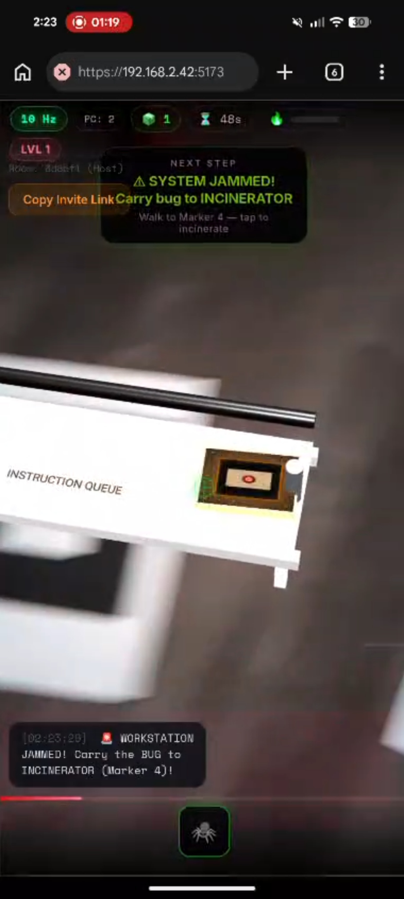
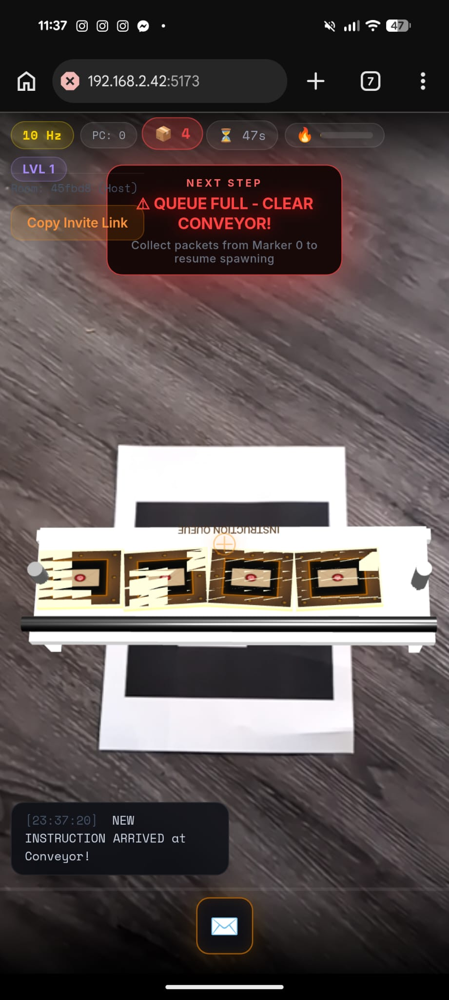

# 🚂 Steampunk Industrial Workshop AR

Welcome to the **Steampunk Industrial Workshop**, a high-fidelity Augmented Reality (AR) simulation of the classic **Fetch-Decode-Execute (FDE)** computer cycle. Step into the role of a Digital Foreman and manage a mechanical processor in a world of brass, steam, and clockwork.

---

## 🎬 Video Tutorial
Watch the quick start guide here: [Randy's AR Workshop Tutorial](https://youtube.com/shorts/AQfGjmLVMMg)

[](https://youtube.com/shorts/AQfGjmLVMMg)

---

## 🚀 How to Run

This project uses **Vite** for a fast development experience.

### Prerequisites

- [Node.js](https://nodejs.org/) installed on your machine.
- A mobile device (recommended) or a webcam for AR tracking.
- Physical AR markers (HiRO or custom barcodes as defined in `index.html`).

### Setup

1. Clone or download the repository.
2. Open your terminal in the project directory.
3. Install dependencies:
   ```bash
   npm install
   ```
4. Start the development server:
   ```bash
   npm run dev
   ```
5. Open the provided local URL (usually `http://localhost:5173`) or the Network URL (e.g., `http://192.168.x.x:5173`) on your phone.

> [!IMPORTANT]
> **HTTPS is required** for mobile camera access. Vite provides a local network URL, but you may need to grant permission for the camera and motion sensors in your browser.

---

## 📂 File Structure Explained

| File             | Purpose                                                                                                                                                          |
| :--------------- | :--------------------------------------------------------------------------------------------------------------------------------------------------------------- |
| `index.html`     | The entry point. Defines the 3D AR scene using **A-Frame**, including all machine models (Conveyor, Forge, Registers), markers, and the steampunk HUD.           |
| `gameplay.js`    | The "Brain" of the operation. Handles marker interactions, gesture detection (pull-to-collect), the instruction pipeline logic, and multiplayer synchronization. |
| `gamestate.js`   | Manages the global state (`GS`). Handles leveling logic, heat management, motion sensor (accelerometer) initialization, and the "Shake to Process" mechanic.     |
| `styles.css`     | A premium CSS file that styles the Steampunk HUD, including flickering vignettes, brass-colored progress bars, and atmospheric UI animations.                    |
| `textures.js`    | Generates dynamic 2D canvas textures for the 3D "blocks" (envelopes, data gems, instructions) so they display real-time values in AR.                            |
| `audio.js`       | Handles sound effects (steam hisses, clunks, alarms) to enhance immersion.                                                                                       |
| `vite.config.js` | Configuration for the build tool, optimized for local network serving.                                                                                           |

---

## ⚙️ Gameplay Logic: The FDE Cycle

The core loop follows the standard computer architecture cycle, gamified for an industrial workshop:

### 1. FETCH (Conveyor - Marker 0)

Walk to the **Belt Conveyor**. When the HUD indicates you are close, **pull your phone back** to grab an incoming instruction envelope from the assembly line.

### 2. DECODE (Dispatch Desk - Marker 1)

Bring the envelope to the **Dispatch Desk**. "Drop" it onto the desk, then **shake your phone** to physically rip open the envelope and reveal the instruction inside. Collect the raw instruction block.

### 3. LOAD OPERAND (Registers - Marker 2 / RAM - Marker 5)

If your instruction (like `ADD [REG]`) requires extra data:

- **Registers**: Fast access to local storage.
- **RAM Cabinet**: Slower, high-capacity storage. Requires a "long shake" to retrieve data if a cache miss occurs.

### 4. EXECUTE (ALU Forge - Marker 3)

Take your instruction and data to the **Forge**. Drop them in and **shake your phone rigorously** to "forge" the result. The fire will flare up, eventually producing a **Result Gem**.

### 5. WRITE-BACK (Registers - Marker 2)

Finally, take the Result Gem back to the **Registers**. Drop it to store the value and complete the clock cycle.

---

## 🛠️ Advanced Mechanics

- **Heat Management**: Every action generates heat. If the heat bar (top) reaches 100%, the system may jam.
- **System Bugs**: Occasionally, a literal "bug" (spider) will jam a workstation. You must grab it and carry it to the **Incinerator (Marker 4)** to clear the error.


- **Overclocking**: Every 5 levels, the system enters "Overclock Fever," where processing is faster but heat builds up rapidly.
- **Multiplayer**: Click "Copy Invite Link" in the HUD to join a friend in the same workshop! You share the same registers and program queue.
- **Queue Overflow**: If the conveyor piles up with more than 4 envelopes, the system will pause spawning new instructions. You must "FETCH" the existing envelopes from **Marker 0** to clear the jam.



---

## 🎨 Design Aesthetics

This project prioritizes a **Premium Steampunk Aesthetic**:

- **Dynamic HUD**: Real-time "Hz" clock, "PC" program counter, and heat-warped vignettes.
- **Micro-Animations**: Bouncing data gems, rattling machines, and smooth HSL transitions.
- **Immersion**: Haptic feedback (vibrations) and 3D positional audio.

---

## 📑 Credits

- **Markers**: Sourced from [Augmented.com](https://au.gmented.com/app/marker/marker.php).
